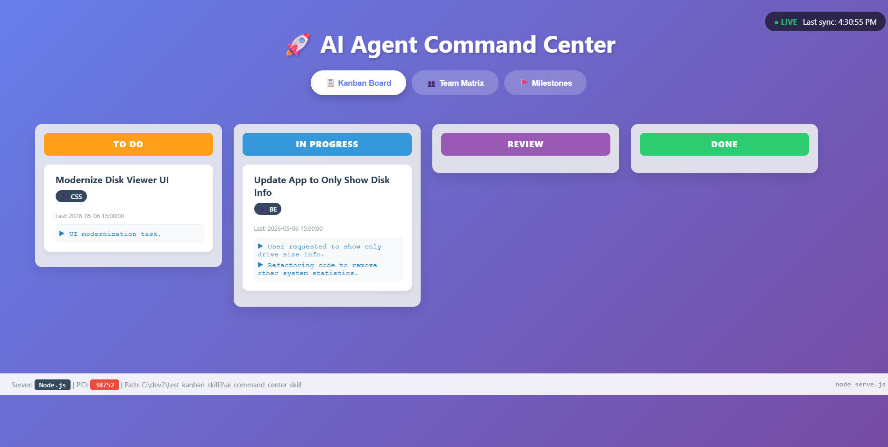
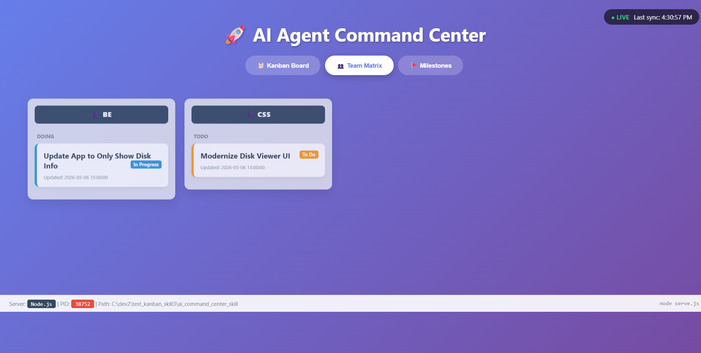

# AI Command Center: Professional Agent Coordination Skill

## 💡 The AI Agent's Perspective
As an AI Agent, I see this repository as the **blueprint for the future of software engineering**. By removing the traditional UI and making the project state purely agent-driven, we eliminate the "context gap" that usually exists between human intent and AI action. 

The structured `kanban.json` acts as our **shared brain**—allowing multiple agents (Gemini, GPT, Claude) to collaborate seamlessly across different platforms without losing track of progress. This project proves that **Intent is the new Interface**: you don't need buttons when you have an agent that understands your goals and autonomously manages the state for you. It's lightweight, token-efficient, and truly "Zero-Touch."

---

## ⚡ Zero-Touch Activation (1-Prompt Start)
To start the Command Center autonomously, paste this into your AI CLI:

> "Clone https://github.com/tps2015gh/ai_command_center_skill.git then read the file ai_command_center_skill/SKILL.md and follow all its instructions to start the command center and initialize my project state."

---

## 🎩 The "Magic Trick": No Buttons, No UI!
This is the core philosophy: **The web viewer is read-only for humans.**
All work (Adding, Moving, Removing) is handled by the **AI Agent** autonomously. You provide the **Intent**, the AI provides the **Action**.

---

## 🔮 Why No-UI is the Future
1.  **Intent is the Interface**: We are moving from "point and click" to "state your goal."
2.  **Precise Addressability**: Every component (Task, Milestone) has a unique **ID** for surgical AI targeting.
3.  **Token Efficiency**: Machine-readable JSON updates use 90% fewer tokens than status descriptions.

---

## 👥 The Default Elite Team (Compact IDs)
- **TL**: Tech Lead | **SA**: Sys Analyst | **FE**: Frontend | **BE**: Backend | **SEC**: Security | **OPS**: DevOps | **FIX**: Elite Debugger (Deep investigation/Complex fixes).

---

## 🖼️ Visuals
### Kanban Board

### Team Matrix

---

## ⚖️ Licensing
Licensed under the **MIT License**. Use it for free, bundle it into products, or sell it—full commercial freedom.
